# tm2.zig
Binary Tsetlin machine library, a machine learning model, written in Zig. Currently, slow training, fast inference performance. Covered by tests. CPU only, yet.

```mermaid
flowchart TD
    %% Блоки входных данных и обработки
    x["Input 'x': n bits&#xA;---&#xA;Результат: x₁ x₂ ... xₙ"]
    nx["Отрицание входов 'nx': n bits&#xA;---&#xA;Результат: nx₁ nx₂ ... nxₙ"]
    l["Литералы 'l': 2n bits&#xA;---&#xA;Результат: l₁ l₂ ... l₂ₙ"]
    
    %% Блоки автоматов и маски
    a["Автоматы 'a': 2m × 2n signed integers&#xA;---&#xA;Результат:&#xA;e₁,₁  e₁,₂  ...  e₁,₂ₙ&#xA;e₂,₁  e₂,₂  ...  e₂,₂ₙ&#xA;...   ...   ...  ...&#xA;eₘ,₁  eₘ,₂  ...  eₘ,₂ₙ&#xA;eₘ₊₁,₁ eₘ₊₁,₂ ... eₘ₊₁,₂ₙ&#xA;eₘ₊₂,₁ eₘ₊₂,₂ ... eₘ₊₂,₂ₙ&#xA;...    ...   ...  ...&#xA;e₂ₘ,₁  e₂ₘ,₂  ...  e₂ₘ,₂ₙ"]
    
    e["Маска исключения 'e': 2m × 2n bits&#xA;---&#xA;Результат:&#xA;e₁,₁  e₁,₂  ...  e₁,₂ₙ&#xA;e₂,₁  e₂,₂  ...  e₂,₂ₙ&#xA;...   ...   ...  ...&#xA;eₘ,₁  eₘ,₂  ...  eₘ,₂ₙ&#xA;eₘ₊₁,₁ eₘ₊₁,₂ ... eₘ₊₁,₂ₙ&#xA;eₘ₊₂,₁ eₘ₊₂,₂ ... eₘ₊₂,₂ₙ&#xA;...    ...   ...  ...&#xA;e₂ₘ,₁  e₂ₘ,₂  ...  e₂ₘ,₂ₙ"]
    
    %% Блоки голосования и результатов
    t["Голоса команды 't': 2m bits&#xA;---&#xA;Результат:&#xA;t₁ t₂ ... tₘ tₘ₊₁ tₘ₊₂ ... t₂ₘ"]
    
    pt["Суммирование голосов&#xA;---&#xA;Результат:&#xA;pt (позитивные)&#xA;nt (негативные)"]
    
    v["Финальное голосование 'v'&#xA;---&#xA;Результат: v"]
    
    y["Предсказание 'y_pred'&#xA;---&#xA;Результат: y_pred"]
    
    %% Связи между блоками с формулами на стрелках
    x -- "nx_i = ~x_i" --> nx
    x -- "x_i" --> l
    nx -- "nx_i" --> l
    l -- "l = stack(x, nx)" --> t
    
    a -- "e_j,i = a_j,i < 0" --> e
    e -- "e_j,i" --> t
    
    t -- "t_j = and(e_j,i ∨ l_i)&#xA;(e₁,₁ ∧ l₁) ∨ (e₁,₂ ∧ l₂) ∨ ... ∨ (e₁,₂ₙ ∧ l₂ₙ)&#xA;..." --> pt
    pt -- "pt = sum(t_1..t_m)&#xA;nt = sum(t_m+1..t_2m)" --> v
    v -- "v = pt - nt" --> y
    y -- "y_pred = v >= 0" --> y_pred["Финальное предсказание"]
    
    %% Стилизация
    classDef input fill:#d4ffd4,stroke:#333,stroke-width:1px
    classDef negate fill:#ffd4ff,stroke:#333,stroke-width:1px
    classDef literals fill:#d4d4d4,stroke:#333,stroke-width:1px
    classDef automata fill:#ffd4d4,stroke:#333,stroke-width:1px
    classDef exclusion fill:#d4d4ff,stroke:#333,stroke-width:1px
    classDef team fill:#d4d4d4,stroke:#333,stroke-width:1px
    classDef votes fill:#d4d4d4,stroke:#333,stroke-width:1px
    classDef prediction fill:#d4d4d4,stroke:#333,stroke-width:1px
    
    class x input
    class nx negate
    class l literals
    class a automata
    class e exclusion
    class t team
    class pt,v votes
    class y,y_pred prediction
```




## Tsetlin machine
In short, Tsetlin machine is a type of machine learning model.

It differs from traditional neural networks and deep learning in that it uses a set of rules to make decisions, rather than relying on complex mathematical functions.

- **low on hyperparameters** - it has only a few hyperparameters mostly for regularization, and you can even omit them or use defaults
- **highly non-linear** - it can learn non-linear patterns without multiple layers
- **weights are interpretable** - if your inputs are interpretable, you can see the logic behind patterns it learned
- **energy efficient** - it does not use floating point computations, it uses bitwise operations and saturating arithmetic, training and inference max time complexity is linear
- **memory efficient** - you do not need to keep inputs for each layer to do backpropagation, you do not need complex optimization algorithms 
- **gradient-free** - your task does not need to be differentiable
- **zero initialization scheme** - it does not require random initialization of weights
- **native 1 bit quantization** - losslessly quantizable down to 1 bit per weight
- **easy pruning** - why transfer learning when you can just prune the model?
- **mature regularization** - no dropout, no L1/L2 regularization, no batch normalization, no data augmentation, no early stopping, no weight decay, no learning rate decay, no momentum, no nothing - just wise skipping of updates

## This work
This implementation uses different probabilities in Type I(a), Type I(b) and Type II feedbacks, same as in [Julia multi-class TM implementation](https://github.com/BooBSD/Tsetlin.jl).

As in Julia implementation, this implementation is multithreaded and uses lock-free Hogwild! approach to update its weights, with per-sample parallelization.

It differs from other implementations by using one array, thus being simple to understand, see i.e. [./examples/01-vectorized.py](./examples/01-vectorized.py) for a **less than 62 lines of code** reference implementation in NumPy (both training and inference).

Automata states in this binary TM represented as a 1D view of a 4D array of signed integers, where first dimension is clause polarity $C^{+}$ and $C^{-}$, second dimension is a clause index, third dimension is original or negated literal, and fourth dimension is a feature index.

So, the shape is `(2, n_clauses, 2, n_features)`, where `n_clauses` is a number of clauses per polarity, and `n_features` is a number of features. For multi-class Tsetlin machine, shape would be `(n_classes, 2, n_clauses, 2, n_features)`, but it is out of scope for this repo.

Same shapes for compiled models. Data type of compiled state is a binary mask of whether state action is include or exclude. Included states are non-negative integers (`states >= 0`), excluded states are negative integers (`states < 0`). This work uses signed automata states, so state action threshold is hardcoded at 0.

Unlike others implementation, this implementation does not use any floating point computations other than logging metrics.

## Changes

- 27 Apr 2025: (5352175c) inference now 5 times faster than the first commit.
- 27 Apr 2025: (8694edda) fixed step size bug, now inference again 5 times faster. It is 25 times faster than the first commit!
- 28 Apr 2025: New ablated resource allocation - twice as fast converging to the same accuracy. 17.5% performance improvement per epoch.
- 29 Apr 2025: 26% training time improvement.
- 29 Apr 2025: Another 25% training time improvement.

## Learn

### Inference

Feature $x_i$ is an input bit at position $i$ in the input vector $X$. It can be either 0 or 1. We have $n_{\text{features}}$ features.

A literal $l_i$ is a feature $x_i$ itself:

$$
l_i = x_i
$$

This way, literal set $L=\{x_0, x_1, \ldots, x_{n_{\text{features}}}\}$ has $n_{\text{literals}} = n_{\text{features}}$ literals.

We can extend literal definition to also have negation of the feature:

$$
l_{i + n_{\text{features}}} = \neg x_i
$$

This way, literal set $L=\{x_0, x_1, \ldots, x_{n_{\text{features}}}, \neg x_0, \neg x_1, \ldots, \neg x_{n_{\text{features}}}\}$ has $n_{\text{literals}} = 2 \cdot n_{\text{features}}$ literals.

> [!IMPORTANT]
> Tsetlin machine does not know about existence of features - it operates on literals. So it does not care whether the feature was negated or not, nor during inference, nor during training.

Literal subset $L_j$ is a subset of literal set $L$ we defined above, i.e.:

$$
L_j = \{l_{42}, l_{69}, l_{1337}\}
$$

Literal subsets are learnable model's parameters. Each of them can be stored either as an index set of included literals, or as a binary mask of included literals. Example: the set `{0, 2}` will be the same as binary mask `[1, 0, 1, 0, 0, 0, 0, 0]` for 8 elements.

Clause $C_j$ is a logical AND of a literal subset $L_j$:

$$
C_j = \bigwedge L_j = \bigwedge_{l_i \in L_j} l_i
$$

Clause is a definition of a single neuron. It fires when all literals in the literal subset are true.

> [!TIP]
> We can omit feature negation in literal definition. This halves number of literals and model size, but clauses may not learn some patterns, i.e. when we want to teach clause to fire when our first feature $x_0$ is 0.

Binary Tsetlin machine defines positive $C^{+}$ and negative $C^{-}$ polarity clauses. Positive polarity clauses votes for target value $y$ being $1$, negative polarity clauses votes for target value $y$ being $0$:

$$
\text{votes} = \sum C^{+} - \sum C^{-}
$$

$$
\hat{y} = \text{votes} \geq 0
$$

That is about binary Tsetlin machine inference.

> [!NOTE]
> Binary Tsetlin machine inference has:
> - time complexity: $O(2 \times n_{\text{clauses per polarity}} \times n_{\text{literals}})$;
> - memory complexity: $O(1)$ extra.
> - storage requirements: `2 * n_clauses * 2 * n_features` bits when implemented using binary masks, or less in other implementations.

### Training

To train literal subset $L_j$, we define automata $A_j$ as a signed integer array of size $n_{\text{literals}}$ with values in full integer range, i.e. $[-2^{31}, 2^{31}-1]$ for 32-bit integers, and threshold $T$ being $0$.

Literal $l_i$ is included in the literal subset $L_j$ if $A_j[i] \geq 0$, and excluded if $A_j[i] < 0$.

This document describes the mechanisms of **Type I** and **Type II Feedback** used in Tsetlin Automata. These feedback mechanisms reinforce or penalize clause actions based on the outputs of the automata and the desired target label $y$.

#### Type I Feedback

Type I feedback is given stochastically to clauses with:
- Positive polarity when $y = 1$
- Negative polarity when $y = 0$

An affected clause reinforces each of its Tsetlin Automata based on:
1. The clause output $C_j(X)$,
2. The action of the targeted Tsetlin Automaton (Include or Exclude),
3. The value of the literal $l_k$ assigned to the automaton.

The two rules governing Type I feedback are as follows:
- Type 1(a) (Recognize): **Include is rewarded** and **Exclude is penalized** with probability $\frac{s-1}{s}$ when $C_j(X) = 1$ and $l_k = 1$. 
  > This creates strong reinforcement, enabling the clause to remember and refine the pattern it recognizes in $X$.
- Type 1(b) (Erase): **Include is penalized** and **Exclude is rewarded** with probability $\frac{1}{s}$ when $C_j(X) = 0$ or $l_k = 0$.
  > This results in weak reinforcement, making infrequent patterns more common.

Here, $s$ is a hyperparameter that controls the frequency of patterns produced.

##### Type I Feedback Table

| State Action    | Clause $C_j(X)$ | Literal $l_k$ | P(Reward)       | P(Penalty)      |
|-----------------|-----------------|---------------|-----------------|-----------------|
| Include Literal | $1$             | $1$           | $\frac{s-1}{s}$ | $0$             |
|                 | $1$             | $0$           | NA              | NA              |
|                 | $0$             | $1$           | $0$             | $\frac{1}{s}$   |
|                 | $0$             | $0$           | $0$             | $\frac{1}{s}$   |
| Exclude Literal | $1$             | $1$           | $0$             | $\frac{s-1}{s}$ |
|                 | $1$             | $0$           | $\frac{1}{s}$   | $0$             |
|                 | $0$             | $1$           | $\frac{1}{s}$   | $0$             |
|                 | $0$             | $0$           | $\frac{1}{s}$   | $0$             |

#### Type II Feedback

Also known as **Reject**,

Type II feedback is given stochastically to clauses with:
- Positive polarity when $y = 0$
- Negative polarity when $y = 1$

An affected clause reinforces each of its Tsetlin Automata based on:
1. The clause output $C_j(X)$,
2. The action of the targeted Tsetlin Automaton (Include or Exclude),
3. The value of the literal $l_k$ assigned to the automaton.

Type II feedback penalizes **Exclude** when $C_j(X) = 1$ and $l_k = 0$.
> This feedback is strong and produces candidate literals for discriminating between $y = 0$ and $y = 1$.

##### Type II Feedback Table

| State Action    | Clause $C_j(X)$ | Literal $l_k$ | P(Reward) | P(Penalty) |
|-----------------|-----------------|---------------|-----------|------------|
| Include Literal | $1$             | $1$           | $0$       | $0$        |
|                 | $1$             | $0$           | NA        | NA         |
|                 | $0$             | $1$           | $0$       | $0$        |
|                 | $0$             | $0$           | $0$       | $0$        |
| Exclude Literal | $1$             | $1$           | $0$       | $0$        |
|                 | $1$             | $0$           | $0$       | $1.0$      |
|                 | $0$             | $1$           | $0$       | $0$        |
|                 | $0$             | $0$           | $0$       | $0$        |

### Resource allocation

We do not want our network to overfit on very similar samples that are prevail in the dataset. This way target value $T$ for $\text{votes}$ was introduced. It means that sample that got votes larger than this threshold will not be used for training in current step.

Original resource allocation defines it as a gradual per-clause update skip:
```zig
// ...in the fit() after counting votes:
const p_clause_update: f32 = @as(f32, @floatFromInt(std.math.clamp(if (target) -votes else votes, -t, t))) / (@as(f32, @floatFromInt(2 * t))) + 0.5;
// feedback loop:
for (0..2) |i_polarity| for (0..n_clauses) |i_clause| if (random.float(f32) < p_clause_update) {
    // give feedback to this automata clause...
};
// return prediction...
```
It can be ablated this to a simple per-sample update skip:
```zig
// ...in the fit() after counting votes:
if (target == true and votes < t or target == false and votes >= -t)) {
    // feedback loop...
}
// return prediction...
```
which does not use floating point computations, division and PRNGs. It gives twice as early converging to the same accuracy, while being a bit slower or equal in an average performance per epoch. This check is an extreme case of the original resource allocation.

## Usage
### IMDB classification
I have achieved 86%+ accuracy (no parameter tuning was performed) at 2.44 MiB compiled state with the following parameters:
```
S: i8, t: 8, r: 11990383208106557440 (0.65), n_features: 40000, n_clauses: 128, state size: 20480000 (19.5MiB)
```
1. Obtain IMDBTrainingData.txt and IMDBTestData.txt using `python3 produce_dataset.py`
2. Convert them to IMDBTrainingData.bin and IMDBTestData.bin using `python3 tobin.py`
3. Run the example:
    ```terminal
    ➜  tm2.zig git:(main) ✗ zig build run -freference-trace --release=fast
    S: i8, t: 8, r: 11990383208106557440 (0.65), n_features: 40000, n_clauses: 128, state size: 20480000 (19.5MiB)
    epoch | epochs | sample | samples | train   | test    | best    | training   | epoch     | train     | compile   | test      | fit perf   | test perf
        1 |     25 |  25000 |   25000 |  69.50% |  56.96% |  56.96% |        54s |   53.539s |   53.383s | 0.001463s | 0.154632s | 468.31it/s | 161674.58it/s
        2 |     25 |  25000 |   25000 |  77.32% |  79.52% |  79.52% |       103s |   49.508s |   49.341s | 0.001692s | 0.165648s | 506.68it/s | 150922.60it/s
        3 |     25 |  25000 |   25000 |  81.07% |  83.93% |  83.93% |       150s |   47.258s |   47.091s | 0.001823s | 0.165112s | 530.89it/s | 151411.95it/s
        4 |     25 |  25000 |   25000 |  80.70% |  73.43% |  83.93% |       197s |   47.155s |   46.987s | 0.001716s | 0.166711s | 532.06it/s | 149960.25it/s
        5 |     25 |  25000 |   25000 |  85.69% |  80.58% |  83.93% |       239s |   41.520s |   41.318s | 0.002205s | 0.199961s | 605.07it/s | 125024.34it/s
    epoch | epochs | sample | samples | train   | test    | best    | training   | epoch     | train     | compile   | test      | fit perf   | test perf
        6 |     25 |  25000 |   25000 |  87.62% |  86.14% |  86.14% |       279s |   40.174s |   39.986s | 0.001704s | 0.186594s | 625.22it/s | 133980.89it/s
        7 |     25 |  25000 |   25000 |  85.58% |  78.56% |  86.14% |       322s |   42.659s |   42.471s | 0.001678s | 0.185732s | 588.63it/s | 134602.77it/s
        8 |     25 |  25000 |   25000 |  86.74% |  85.66% |  86.14% |       364s |   41.694s |   41.514s | 0.001775s | 0.178146s | 602.21it/s | 140334.25it/s
        9 |     25 |  25000 |   25000 |  87.01% |  63.98% |  86.14% |       406s |   42.283s |   42.101s | 0.001741s | 0.179433s | 593.81it/s | 139327.89it/s
       10 |     25 |  25000 |   25000 |  86.74% |  86.74% |  86.74% |       448s |   42.217s |   42.029s | 0.001670s | 0.185978s | 594.82it/s | 134424.70it/s
    epoch | epochs | sample | samples | train   | test    | best    | training   | epoch     | train     | compile   | test      | fit perf   | test perf
       11 |     25 |  25000 |   25000 |  88.99% |  85.72% |  86.74% |       490s |   41.799s |   41.600s | 0.001738s | 0.197014s | 600.96it/s | 126894.66it/s
       12 |     25 |  25000 |   25000 |  86.76% |  83.33% |  86.74% |       533s |   43.596s |   43.405s | 0.002059s | 0.188395s | 575.96it/s | 132700.11it/s
       13 |     25 |  25000 |   25000 |  86.21% |  87.02% |  87.02% |       578s |   44.101s |   43.904s | 0.001757s | 0.194927s | 569.42it/s | 128253.32it/s
       14 |     25 |  25000 |   25000 |  87.63% |  86.79% |  87.02% |       621s |   43.061s |   42.870s | 0.001700s | 0.189257s | 583.16it/s | 132095.62it/s
       15 |     25 |  25000 |   25000 |  86.83% |  86.47% |  87.02% |       663s |   42.903s |   42.707s | 0.001720s | 0.194448s | 585.38it/s | 128569.02it/s
    epoch | epochs | sample | samples | train   | test    | best    | training   | epoch     | train     | compile   | test      | fit perf   | test perf
       16 |     25 |  25000 |   25000 |  87.53% |  86.80% |  87.02% |       707s |   43.116s |   42.922s | 0.001919s | 0.191783s | 582.45it/s | 130355.41it/s
       17 |     25 |  25000 |   25000 |  86.14% |  72.12% |  87.02% |       751s |   43.981s |   43.792s | 0.001130s | 0.188627s | 570.89it/s | 132536.64it/s
       18 |     25 |  25000 |   25000 |  86.42% |  86.63% |  87.02% |       794s |   43.572s |   43.380s | 0.001695s | 0.190637s | 576.31it/s | 131139.03it/s
       19 |     25 |  25000 |   25000 |  87.65% |  86.62% |  87.02% |       838s |   43.463s |   43.268s | 0.001495s | 0.193896s | 577.80it/s | 128934.91it/s
       20 |     25 |  25000 |   25000 |  89.60% |  86.51% |  87.02% |       878s |   40.383s |   40.187s | 0.001621s | 0.194118s | 622.10it/s | 128787.34it/s
    ```

Repo will be active until I find a job or will lost hope in TM or figure out how to get money out of this thing. If you want to help - you are welcome, please fork and send PRs (or money). If you need help, feel free to open issue or contact me 😏.

## License
Licensed under either of

* Apache License, Version 2.0, ([LICENSE-APACHE-2.0](LICENSE-APACHE-2.0) or http://www.apache.org/licenses/LICENSE-2.0)
* MIT license ([LICENSE-MIT](LICENSE-MIT) or http://opensource.org/licenses/MIT)

at your option.

## Contribution
Unless you explicitly state otherwise, any contribution intentionally submitted for inclusion in the work by you, as defined in the Apache-2.0 license, shall be dual licensed as above, without any additional terms or conditions.

